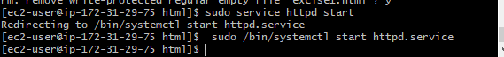

**说明:** 按照我对题目一的理解应该是设计一个HTML文件，文件上有一个跳转链接button，点击该button  
会跳转到一个网页，该网页会自动一步步展示创建EC2快照的过程，自动实现的过程，我不知如何实现，我想  
应该需要CSS之类的，放弃了，现在我想把创建过程中的一些主要步骤放到这个markdown文件中，该文件会  
上传到我的github，我的AWS服务器中有一个HTML文件，该文件可以跳转到这个Markdown文件  
**编辑公式需要使用** 
<script type="text/javascript" src="http://cdn.mathjax.org/mathjax/latest/MathJax.js?config=default"></script>  
{公式手册}(https://www.zybuluo.com/codeep/note/163962)
# 创建EC2快照  
## 创建 Instance  
1. 打开控制台，进入ec2，点击launch instance，一步步，直到step6，如果没有现有秘钥，新建一个秘钥并  
下载下来，我一般保存到user下的.ssh目录中，创建好并完成初始化的instance如下  
  
2. 从本地连接到服务器  
使用`cd /.ssh`命令进入到秘钥所在文件夹，输入命令`ssh ec2-user@ip -i key.pem`,ip是创建instance  
的public IP,key 是生成的秘钥的名字，连接成功后终端会显示如下：  
  
连接成功后又这么一句提示'Run "sudo yum update" to apply all updates.'，我就输入命令`sudo yum update`  
然后依次输入如下命令部署apache服务器，我采用的是linux + apache + mySQL + php  
```
sudo yum install gcc gcc-c++ make
sudo yum install apache mysql php php-mysql mysql-server
```  
其实，第一行碎玉这个任务是不必要的，是我的习惯，习惯给新环境安装C++编译环境，上述命令执行完成后  
apache 就安装成功了，使用  
```
apachectl -v
httpd -v
```  
查看版本号，并测试是否可以正常使用  
* 环境已经搭建好了，下面就是设计HTML文件了，我选择在本地安装filezilla用于在本地和服务器之间  
传递文件，设置秘钥-建立站点-连接成功后的结果如下  
  
3. 设计HTML文件  
进入到`/var/www/html`新建一个HTML文件`sudo touch excise1.html`，使用filezilla 传到本地，在  
本地编辑，完成后再上传到服务器，传输完成的如上图所示，then 使用`sudo service httpd start` 启动服务器，then 从ec2 实例中找到public dns,拷贝到浏览器中并加入html文件的文件名，如下图所示  
  
点击页面上的excise button就会跳转到指定的页面  
**Note：** 这里有一点不同，使用`sudo service httpd start`  
会提示如下图所示，按照提示重新输入提示命令即可启动服务器  
 

## create volume  
由于现有硬盘已经有snapshot了，为了演示创建快照的过程，先创建一个volume，在左侧导航栏中点击volume后如下图  
  
这里注意，availability zone 一定要与想要添加到的实例一致，其它我选择默认的，很明显，这里添加了一个100G的SSD，  
速度要比普通硬盘快，点击下方create按钮，创建成功，然后添加到instance中  
  
点击 attach volume ，填写上instance ID和 device，这里我命名的device是/dev/sdf，但创建后变成了xvdf，  
attach后，发生变化如下图  
  
  
可以看出多了一个100G的盘，使用`sudo mkfl -t ext4 /dev/xvdf`给xvdf创建文件系统，then使用`sudo file -s /dev/xvdf`确认，结果如下  
  
可以看到该硬盘已经建立了ext4文件系统，接下来使用mount命令将该文件系统加入到该instance的文件  
系统中（从下图可以看出，虽然该volume attach到了instance中，文件系统并没有发生改变）  
  
mount命令和挂载后的结果如下图示  
  
**Note:**还需要将`/dev/xvdf       /data   ext4    defaults,nofail        0       2`加入到/etc/fstab  
文件中，操作与上面HTML文件相同，在/etc中找到fstab 文件，传输到本地编辑，再上传到服务器  

  
不过，我挂载失败了（如下图mount poit not exist），我检查了所有步骤，没发现问题，还没找出原因，虽然不影响创建快照，但是重启系统就会找不到新添加的volume  
    
* 创建快照过程如下  
  
  
等一会就创建好了    
